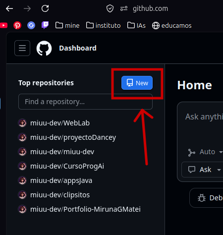
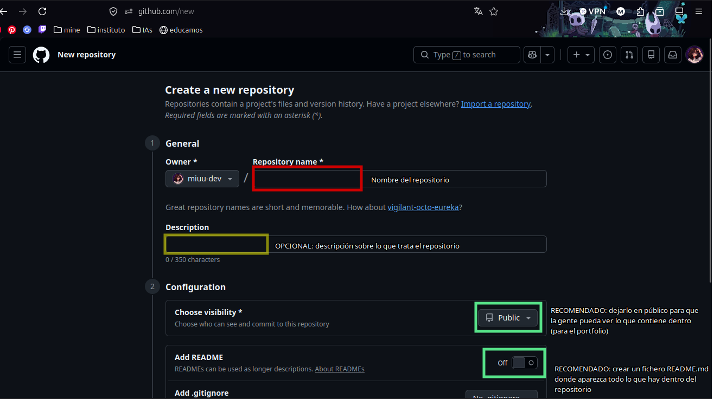
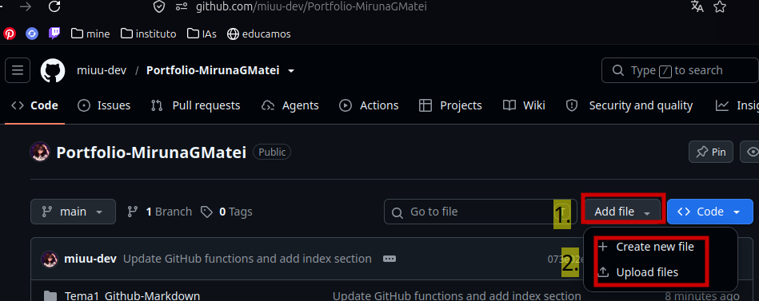
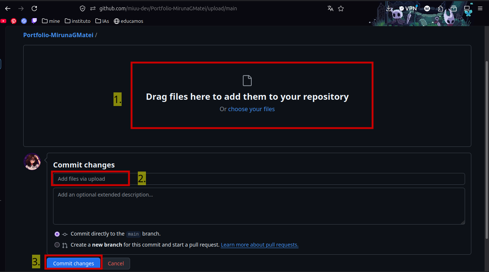
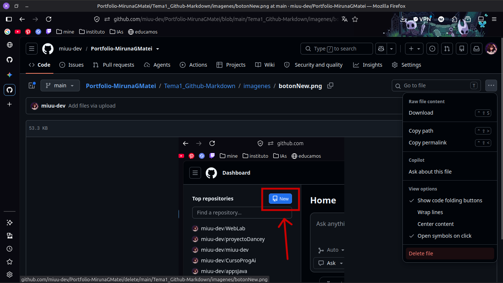
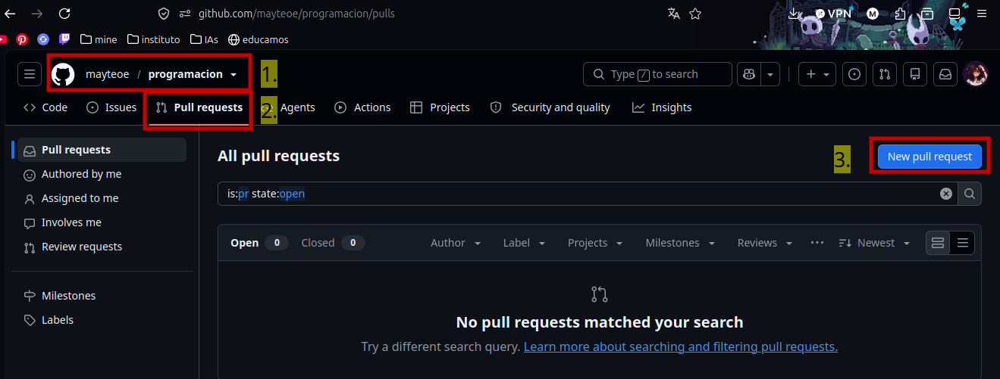

# GitHub y sus funciones
> **Autora:** Miruna Georgiana Matei
> **Curso:** 2do DAW

## ÍNDICE
* [Introducción](#introducción)
* [Pasos a seguir](#pasos-a-seguir)
* [Conclusión](#conclusión)

## Introducción
### ¿Qué es GitHub?
Sin usar términos técnicos, **GitHub** es como el _Google Docs_ de la programación, pero mezclamos una biblioteca pública y un portfolio de trabajos.

En ella creas lo que se llaman **repositorios**, o su abreviación, **REPO**. Hay dos tipos, los cuáles su única diferencia es la **visualización**. 

Puedes ser:
* Públicos
* Privados

## Función de GitHub

Dentro de cada repositorio, puedes añadir y/o crear carpetas y ficheros. Cada vez que realizar algún cambio, ya sea **borrar**, **actualizar** o **crear** dentro del repositorio, has de añadir una breve *descripción* sobre lo realizado, también conocido como **"commit"**. (También puedes añadir una descripción más explícita, pero es **opcional**).

Además, en los repositorios **públicos**, los compañeros o cualquier persona interesada en el tema del REPO, puede sugerir alguna mejorar donde el dueño puede revisar y dar el visto bueno para integrarlo. También es conocido como '**Pull Request**'.

Por último, tenemos el perfil, aunque la gente a veces piense que el diseño del perfil no es gran cosa, a la hora de mostrar en tu currículum tu portfolio, puede decir y ayudar bastante. Considéralo como **tu perfil de Instagram profesional**, o un currículum visual.

Aquí tenemos un ejemplo:

    

> Además, puedes guardar un historial exacto de quién cambió qué y poder volver atrás si algo falla y organizar tareas con *Issues/Projects*

## Pasos a seguir
### Crear repositorio
1. Entras en [GitHub](https://github.com/)
2. Arriba a la izquierda aparece un botón que pone **New** (si lo tienes en inglés)

    

3. Ponerle un nombre (OBLIGATORIO), una descripción (OPCIONAL), dejalo en público y añadir un fichero README.md automáticamente (RECOMENDADO)

  

### Subir o crear ficheros
1. Dentro del repositorio, arriba a la derecha le das a "Add file"
2. Para **crearlo**: Create new File ; para **subirlo**: Upload files

  

3. Si le das a crear, puedes escribir dentro de él y estará en formato .md (markdown) ; si lo quieres subir, puedes poner encima los ficheros/carpetas/imagenes o buscarlos uno a uno.

> [!WARNING]
> Poner **siempre** una breve descripción
   
> [!TIP]
> Poner una breve descripción con **TUS** palabras.

4. Le das a "commit changes"

  

### Eliminar fichero
1. Entras en el directorio del fichero que quieres borrar
2. Le das arriba a la izquierda a "..." y le das a "delete file" 

  

### Dar ideas en x repositorio como mejora
1. Entramos al perfil del autor del repositorio
2. Entramos dentro del repositorio
3. Vamos donde pone "Pull Requests"
4. Le damos a "New pull request" para añadir nuestra idea

  

## Conclusión
GitHub no es al final solo una *carpeta en la nube*; es una herramienta donde la teoría de clase, algún trabajo o incluso alguna aplicaciones se convierte en equipo real donde podemos coordinar con otros compañeros de trabajo o de clase, podemos documentar el código en un README.md o incluso demostrar de lo que eres capaz a una empresa. Además, te ahorra mucho trabajo a la hora de saber lo básico de GitHub, no será necesario enviar documentos por separado o un .zip, con el enlace del repositorio es más que suficiente.
